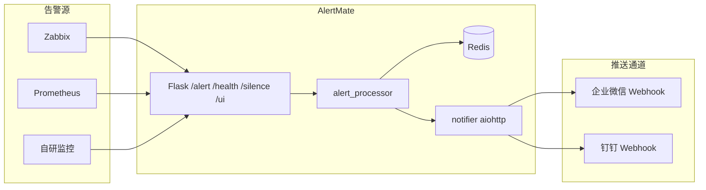

# AlertMate

轻量级告警聚合服务：接收 Zabbix、Prometheus、自研监控等系统的告警，按 5 分钟窗口去重并分级降噪后，通过企业微信 / 钉钉机器人推送给运维团队。

## 架构



- **统一入口**：`POST /alert` 接收 JSON。
- **去重**：`(source + name + target)` 的 MD5 作为 Redis key，窗口 TTL 默认 300 秒；`INCR` 与首次 `EXPIRE` 走 pipeline。
- **分级**：P0 首次立即推送并 `@all`；P1 首次推送，累计 3 次再发「持续告警」；P2 只记日志。
- **推送**：多个企业微信 Webhook 用 `asyncio` + `aiohttp` 并行发送；钉钉默认关闭，打开即可。
- **进阶**：静默、每日 TOP 5、早上 9 点昨日报告、配置热加载、简易管理页。

## 快速开始

### 1. 启动 Redis

```bash
docker run -d --name alertmate-redis -p 6379:6379 redis:7-alpine
```

或使用本仓库的 Compose（同时启动应用）：

```bash
cp .env.example .env
# 编辑 .env，填入 WECOM_WEBHOOKS
docker compose up -d --build
```

### 2. 本地 Python 运行

需要 Python 3.9+。

```bash
python3 -m venv .venv
source .venv/bin/activate
pip install -r requirements.txt
cp .env.example .env
python app.py
```

默认监听 `0.0.0.0:8080`。管理页：<http://127.0.0.1:8080/> 。

### 3. 仅容器运行应用（Redis 已存在）

```bash
docker build -t alertmate .
docker run --rm -p 8080:8080 \
  --env-file .env \
  -e REDIS_URL=redis://host.docker.internal:6379/0 \
  alertmate
```

## API

### `GET /health`

Redis 可达时返回 200：

```json
{"status": "ok", "redis": "ok", "service": "alertmate"}
```

Redis 不可达时返回 503，`status` 为 `degraded`。

### `POST /alert`

```bash
curl -sS -X POST http://127.0.0.1:8080/alert \
  -H 'Content-Type: application/json' \
  -d '{
    "source": "zabbix",
    "name": "CPU high",
    "level": "P1",
    "target": "10.0.0.8",
    "detail": "cpu idle < 5% for 3m"
  }'
```

成功响应示例：

```json
{
  "ok": true,
  "sent": true,
  "count": 1,
  "level": "P1",
  "alert_type": "首次告警",
  "silenced": false
}
```

| 字段 | 说明 |
|------|------|
| `source` | 告警源 |
| `name` | 告警名称 |
| `level` | `P0` / `P1` / `P2`（大小写不敏感） |
| `target` | 目标 IP 或服务名 |
| `detail` | 详情 |

窗口内相同指纹会累加 `count`。P0 仅 `count==1` 发送；P1 在 `1` 与 `3` 发送。

### `POST /silence`

按 `name` + `target` 静默一段时间。静默期内仍计数与统计，但不推送。

```bash
curl -sS -X POST http://127.0.0.1:8080/silence \
  -H 'Content-Type: application/json' \
  -d '{"name":"CPU high","target":"10.0.0.8","duration_seconds":3600}'
```

也可用 `"until": "2026-09-02T23:00:00+08:00"`。

### `POST /webhook/prometheus`

接收 Alertmanager webhook，将 firing 告警映射为内部格式后走同一套去重逻辑。

### `GET /` 或 `GET /ui`

简易管理页：健康状态、今日 TOP 5、最近处理记录、静默表单、脱敏后的当前配置。

## 配置说明

优先读取项目根目录 `.env`，其次是进程环境变量。修改 `.env` 后约 2 秒热加载（**HOST / PORT 除外，需重启**）。

| 变量 | 默认 | 说明 |
|------|------|------|
| `REDIS_URL` | `redis://127.0.0.1:6379/0` | Redis 连接 |
| `WECOM_WEBHOOKS` | 空 | 企业微信机器人地址，逗号分隔，并行发送 |
| `DINGTALK_ENABLED` | `false` | 是否启用钉钉 |
| `DINGTALK_WEBHOOKS` | 空 | 钉钉机器人地址，逗号分隔 |
| `ALERT_WINDOW_TTL` | `300` | 去重窗口秒数 |
| `HOST` / `PORT` | `0.0.0.0` / `8080` | 监听地址 |
| `TZ` | `Asia/Shanghai` | 统计与报告时区 |
| `REPORT_HOUR` / `REPORT_MINUTE` | `9` / `0` | 每日昨日 TOP 5 推送时间 |
| `STATS_TTL` | `172800` | 日统计 Sorted Set 过期秒数 |
| `LOG_LEVEL` | `INFO` | 日志级别 |
| `HOT_RELOAD_INTERVAL` | `2` | 配置文件轮询秒数 |

Webhook 正文为 Markdown，包含：告警名称、级别、目标、类型（首次/持续）、累计次数、详情、时间。P0 在企业微信 Markdown 中带 `<@all>`，钉钉使用 `at.isAtAll`。

## 监控系统对接示例

### Zabbix

1. 管理 → 报警媒介类型 → 创建 **Webhook**。
2. 脚本参数使用 Zabbix 宏，HTTP 调用 AlertMate：

```bash
#!/bin/bash
# 作为 Zabbix 远程命令 / 自定义脚本媒介示例
curl -sS -X POST "${ALERTMATE_URL:-http://127.0.0.1:8080/alert}" \
  -H 'Content-Type: application/json' \
  -d "{
    \"source\": \"zabbix\",
    \"name\": \"${ALERT.NAME}\",
    \"level\": \"P1\",
    \"target\": \"${HOST.CONN}\",
    \"detail\": \"${ALERT.MESSAGE}\"
  }"
```

在媒介类型里把 `level` 按触发器严重级别映射：Disaster/High → `P0`，Average/Warning → `P1`，其余 → `P2`。

### Prometheus Alertmanager

`alertmanager.yml`：

```yaml
receivers:
  - name: alertmate
    webhook_configs:
      - url: "http://alertmate:8080/webhook/prometheus"
        send_resolved: false

route:
  receiver: alertmate
  group_wait: 0s
  group_interval: 1m
  repeat_interval: 5m
```

标签约定：`alertname` → 名称，`instance`/`job` → target，`severity`：`critical`→P0，`warning`→P1，其它→P2。也可让自研系统直接 `POST /alert`。

## systemd 开机自启

1. 将代码放到 `/opt/alertmate`，创建用户并安装依赖。
2. 复制 [`alertmate.service`](alertmate.service)，按实际路径修改 `WorkingDirectory` / `ExecStart` / `User`。
3. 启用服务：

```bash
sudo useradd --system --home /opt/alertmate --shell /usr/sbin/nologin alertmate
sudo cp alertmate.service /etc/systemd/system/alertmate.service
sudo systemctl daemon-reload
sudo systemctl enable --now alertmate
```

请确保本机 Redis 已运行（或把 `REDIS_URL` 指到远程实例）。

## 项目结构

| 文件 | 职责 |
|------|------|
| `app.py` | Flask 路由、调度、热加载挂载、管理页 |
| `alert_processor.py` | 指纹、去重、分级、静默、日 TOP |
| `notifier.py` | 企业微信 / 钉钉 Markdown 并行推送 |
| `config.py` | 环境变量与热加载 |
| `templates/index.html` | 管理页 |

## 许可证

MIT License。
